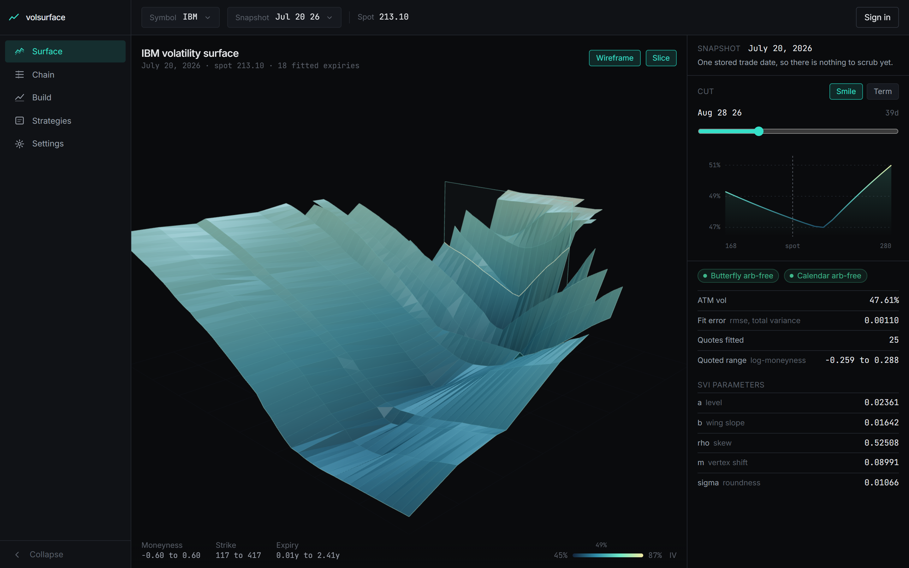
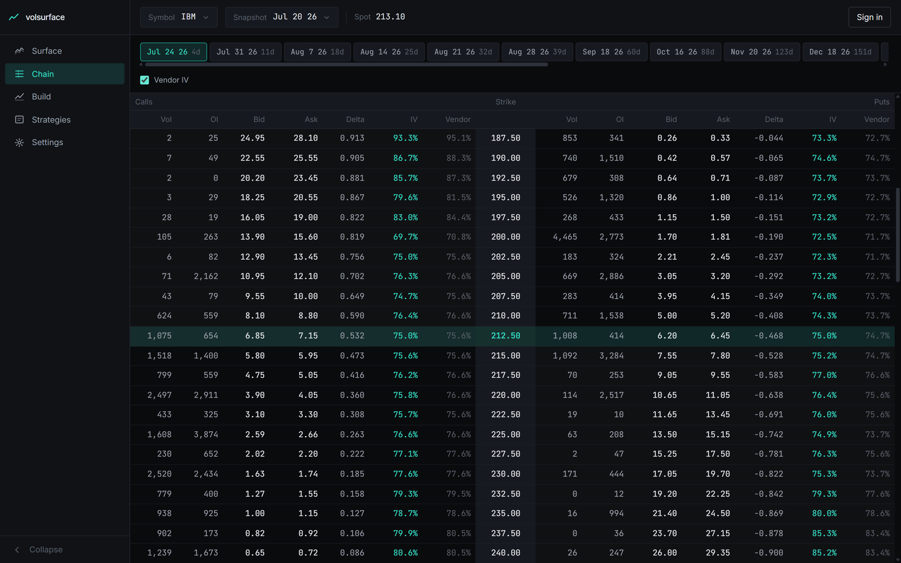
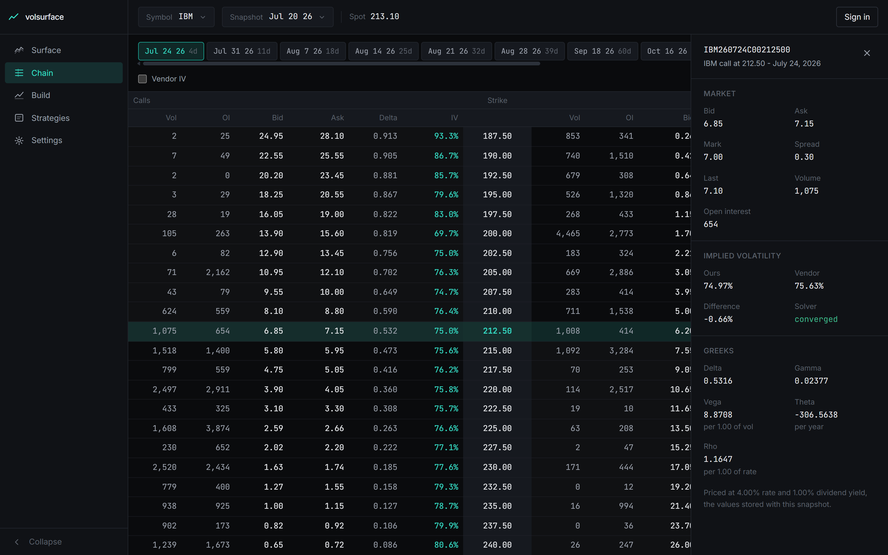
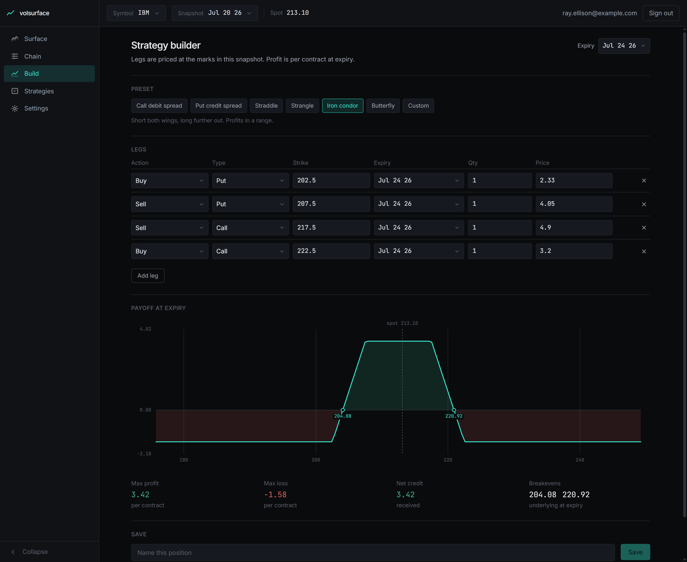
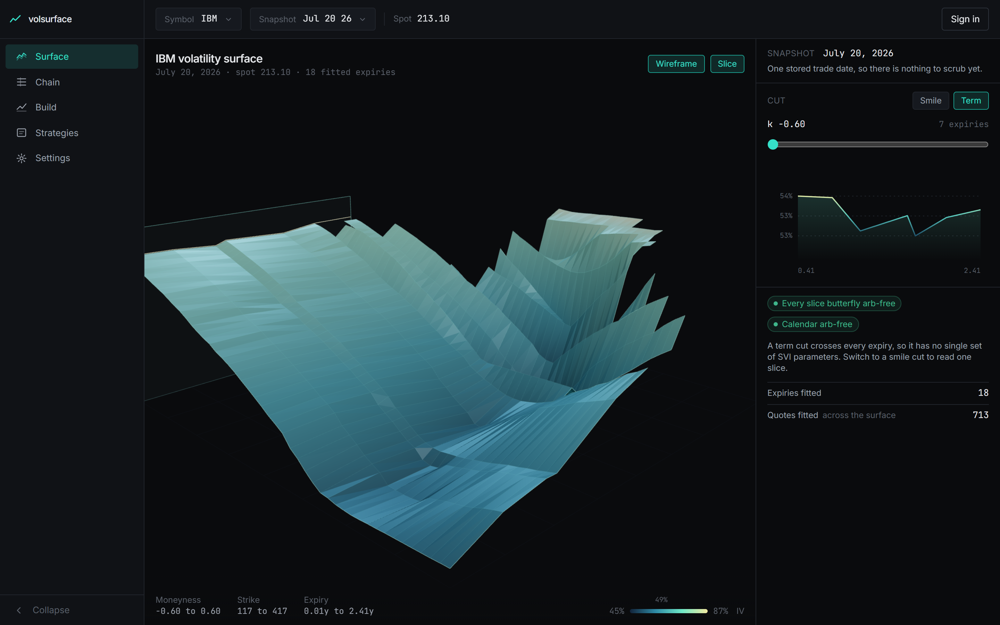
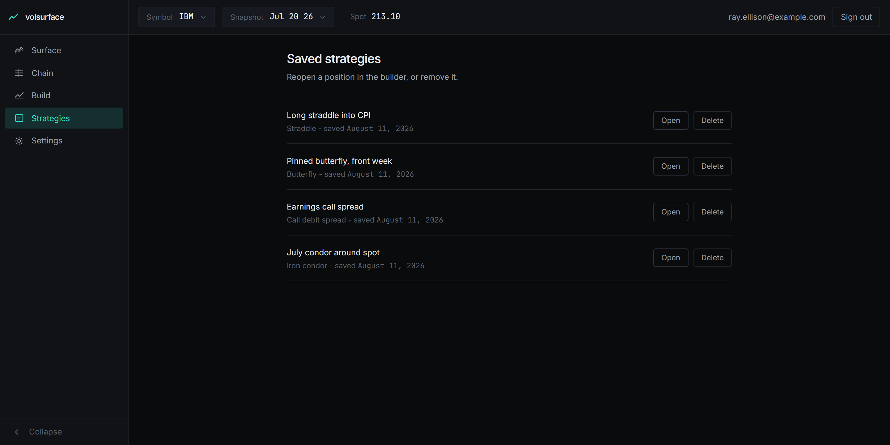

# volsurface

> Price options against a real chain, solve the implied volatility yourself, and read the whole surface in 3D.

<p align="center">
  
  
  
  
</p>

<p align="center">
  
</p>

Point it at an option chain. It solves an implied volatility for every quote, fits an arbitrage-free SVI surface across the expiries, and renders it as a surface you can orbit and slice. The chain, the greeks, and the strategy payoffs all come from the same engine.

The math is deterministic and lives on its own. No model, no service, and no database sits between a quote and its solved volatility, so the same inputs always give the same number and every result can be checked against the chain it came from.

## How it works

1. A chain arrives as a vendor payload or the committed fixture, and is stored as a dated snapshot.
2. The underlying price is recovered from put-call parity rather than trusted from a field, weighted toward the strike where the call and put are closest.
3. Every quote is checked against the no-arbitrage bounds, then solved for implied volatility by Newton-Raphson from a Brenner-Subrahmanyam seed, falling back to Brent in the deep wings where vega collapses.
4. Each expiry is fitted with an SVI slice, and the fits are repaired for calendar arbitrage where the total variance crosses.
5. The fitted slices become a grid the client draws as a mesh, sliceable along either strike or expiry.
6. Strategy payoffs are solved on the piecewise-linear segments, so breakevens and extremes are exact rather than sampled off the render grid.

## Features

**Your implied vols, checked against the vendor's.** Every IV and greek in the chain is solved locally. Turning on the vendor column puts their number beside ours on the same row, so the engine is auditable against the data it was given rather than asking to be trusted.

<p align="center">
  
</p>

Across the full 2444-contract IBM chain, our implied vols reproduce every solved quote to within a cent, and agree with the vendor's own published vols to a median of 0.004. The chain also recovers its own spot price and a 1% dividend yield, neither of which the vendor publishes.

**Every contract opens to its full state.** Selecting a row slides in the greeks, both implied vols with the difference between them, and whether the solver converged or fell back.

<p align="center">
  
</p>

**Multi-leg payoffs with exact breakevens.** Presets cover the standard structures, or build the legs yourself. Max profit, max loss, net debit or credit, and every breakeven are solved from the segments, not read off the curve.

<p align="center">
  
</p>

**The surface reads two ways.** The slice plane sweeps along strike for the smile at one expiry, or along moneyness for the term structure across all of them. Each cut reports its own SVI parameters and whether it is free of butterfly and calendar arbitrage.

<p align="center">
  
</p>

**Positions you can come back to.** Saved strategies reopen in the builder with their legs intact.

<p align="center">
  
</p>

## Pricing engine

The math lives in `engine/`, as pure TypeScript with no server, UI, or database dependencies.

- European options via Black-Scholes-Merton with a continuous dividend yield, and the full greek set. Vega is quoted per 1.00 of vol, theta per year, rho per 1.00 of rate.
- American options via a CRR binomial tree with early exercise tested at every node. Adjacent step counts are averaged by default to damp the convergence sawtooth, with an optional Black-Scholes control variate.
- Implied volatility from a no-arbitrage bounds check, a Brenner-Subrahmanyam seed, Newton-Raphson, and a Brent fallback for the deep-wing quotes where vega collapses and Newton stalls.
- Payoff construction for arbitrary multi-leg positions, with exact breakevens and max profit/loss solved on the piecewise-linear segments. Verticals, straddles, strangles, iron condors, butterflies, covered calls, and collars ship as presets.

## Tech

| Layer | Choice |
| --- | --- |
| Engine | Pure TypeScript. Pricing, greeks, implied vol, SVI fitting, and payoffs, with no I/O |
| Backend | Hono on Bun. API, auth, and the chain ingest |
| Frontend | React 19 and Vite. Three.js through react-three-fiber for the surface |
| Database | Postgres with Drizzle |
| Queue | Redis with BullMQ, for scheduled chain snapshots |
| Auth | Better Auth |
| Testing | Vitest across all three services, plus Playwright for browser flows |

## Notes on the stack

**The engine is vendored, not imported.** `backend` and `frontend` each carry their own copy, generated by `bun run sync-engine`, so each service builds and deploys without reaching outside its own folder. Edit the math in `engine/` and re-run the sync. `bun run verify` fails if a copy has drifted, and a separate check fails if either service imports across the boundary.

**The surface is fitted, not interpolated.** Each expiry gets a real SVI slice, which is what makes the wings meaningful where quotes are thin and lets the arbitrage checks mean something. A smooth mesh drawn straight through the quoted points would look the same and say nothing.

**Spot is derived, not read.** The vendor payload carries no underlying price, so it comes from put-call parity, weighted toward the strike where the call and put are closest in value. Deep wings are dominated by spread noise and drag the estimate off.

## Requirements

Bun, Node 20.19+ (or 22.12+), and Docker for Postgres and Redis.

## Setup

```bash
docker compose up -d
bun run sync-engine
```

Then the API:

```bash
cd backend
bun install
cp .env.example .env
bun run db:migrate
bun run src/scripts/ingest.ts IBM
bun run dev
```

`bun run worker` runs the scheduled chain snapshots alongside it.

In `backend/.env`, `BETTER_AUTH_SECRET` must be at least 32 characters. `MARKET_DATA_SOURCE` selects where chains come from: `fixture` reads the committed chain and needs no key, `alphavantage` calls the live API and needs `ALPHA_VANTAGE_API_KEY` on a plan that includes option chains. A market-data API key is read server-side only and is never sent to the browser.

Then the web client:

```bash
cd frontend
bun install
cp .env.example .env
bun run dev
```

`VITE_API_URL` points at the API and must match the backend's `WEB_ORIGIN`, which is the only origin allowed through CORS.

## Layout

```
engine/     pricing math and its test suite - the canonical source
backend/    API and data layer
frontend/   web client
fixtures/   real option-chain data used by the tests
scripts/    engine sync and repo checks
```

## Checks

```bash
bun run verify
```

Runs the linter, confirms the engine copies are in sync, checks that neither service imports across a boundary, typechecks every service, runs the 427 unit and component tests, and builds the client.

Browser tests run separately against a running API and client:

```bash
cd frontend
bun run test:e2e
```
